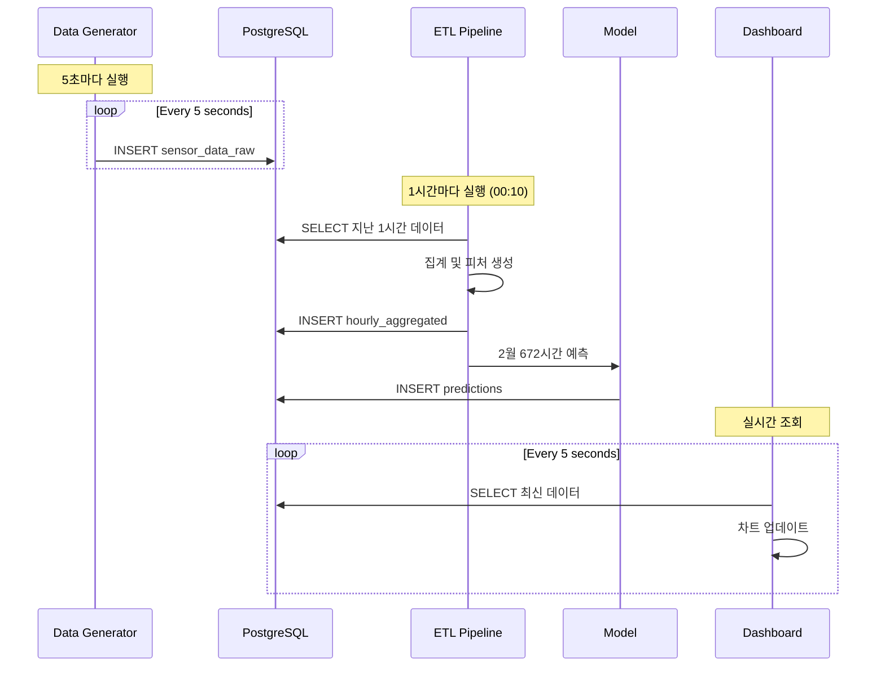
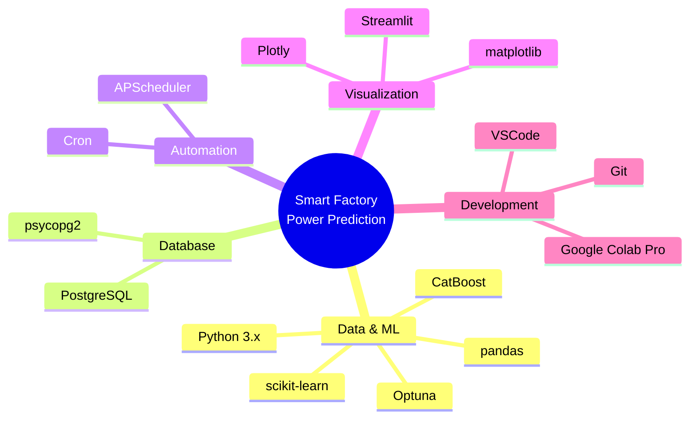

# Smart Factory Architecture - Mermaid Diagram

---

## 데이터 아키텍쳐

```mermaid
sequenceDiagram
    participant G as Data Generator
    participant DB as PostgreSQL
    participant E as ETL Pipeline
    participant M as Model
    participant D as Dashboard
    
    Note over G: 5초마다 실행
    loop Every 5 seconds
        G->>DB: INSERT sensor_data_raw
    end
    
    Note over E: 1시간마다 실행 (00:10)
    E->>DB: SELECT 지난 1시간 데이터
    E->>E: 집계 및 피처 생성
    E->>DB: INSERT hourly_aggregated
    E->>M: 2월 672시간 예측
    M->>DB: INSERT predictions
    
    Note over D: 실시간 조회
    loop Every 5 seconds
        D->>DB: SELECT 최신 데이터
        D->>D: 차트 업데이트
    end
```

---

## 기술 스택 (Mermaid mindmap)

```mermaid
mindmap
  root((Smart Factory<br/>Power Prediction))
    Data & ML
      Python 3.x
      pandas
      scikit-learn
      CatBoost
      Optuna
    Database
      PostgreSQL
      psycopg2
    Automation
      APScheduler
      Cron
    Visualization
      Streamlit
      Plotly
      matplotlib
    Development
      Google Colab Pro
      VSCode
      Git
```
