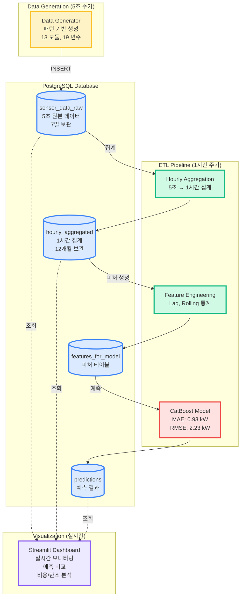
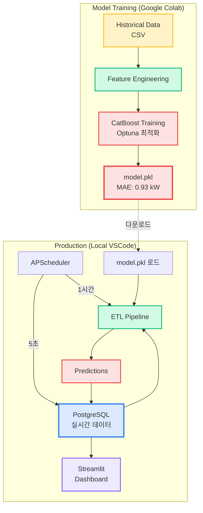

# Smart Factory Architecture - Mermaid Diagram

---

## Option 1: 전체 시스템 플로우

---

## Option 2: APScheduler 스케줄링 중심

---

## Option 3: 데이터베이스 스키마 중심

---

## Option 4: 학습 vs 운영 분리

---

## Option 5: 시계열 데이터 흐름

---

## 각 옵션 사용 시나리오

- **Option 1**: 전체 시스템 개요 설명 (README 메인)
- **Option 2**: 자동화 스케줄링 강조
- **Option 3**: 데이터베이스 설계 문서
- **Option 4**: 학습/운영 환경 분리 설명
- **Option 5**: 실시간 데이터 흐름 설명

---

## 기술 스택 (Mermaid mindmap)

---

## 성능 지표

