# Smart Factory Architecture - Mermaid Diagram

---

## 🎯 추천: 심플 가로형 (README 메인용)

```mermaid
graph LR
    A["📊 데이터 생성<br/><b>5초 주기</b><br/>패턴 기반<br/>13 모듈"]
    B[("🗄️ PostgreSQL<br/><b>4개 테이블</b><br/>실시간 저장")]
    C["⚙️ ETL + 예측<br/><b>1시간 주기</b><br/>CatBoost<br/>MAE 0.93kW"]
    D["📊 대시보드<br/><b>실시간</b><br/>Streamlit<br/>모니터링"]
    
    A -->|"INSERT"| B
    B -->|"집계"| C
    C -->|"예측"| B
    B -.->|"조회"| D
    
    style A fill:#fbbf24,stroke:#f59e0b,stroke-width:4px,color:#000
    style B fill:#3b82f6,stroke:#1d4ed8,stroke-width:4px,color:#fff
    style C fill:#10b981,stroke:#059669,stroke-width:4px,color:#000
    style D fill:#8b5cf6,stroke:#7c3aed,stroke-width:4px,color:#fff
```

---

## Option 1: 전체 시스템 플로우 (가로형 - 다크모드 최적화)

```mermaid
graph LR
    A["📊 Data Generator<br/><b>패턴 기반 생성</b><br/>13 모듈, 19 변수<br/>(5초 주기)"]
    
    B1[("🗄️ sensor_data_raw<br/><b>5초 원본</b><br/>7일 보관")]
    B2[("📊 hourly_aggregated<br/><b>1시간 집계</b><br/>12개월 보관")]
    B3[("🔧 features_for_model<br/><b>피처 테이블</b>")]
    B4[("💾 predictions<br/><b>예측 결과</b>")]
    
    C1["⚙️ Hourly Aggregation<br/><b>5초 → 1시간</b><br/>(1시간 주기)"]
    C2["🔧 Feature Engineering<br/><b>Lag, Rolling 통계</b>"]
    C3["🤖 CatBoost Model<br/><b>MAE: 0.93 kW</b><br/>RMSE: 2.23 kW"]
    
    D["📊 Streamlit Dashboard<br/><b>실시간 모니터링</b><br/>예측 vs 실제 비교<br/>비용/탄소 분석"]
    
    A -->|"INSERT"| B1
    B1 -->|"집계"| C1
    C1 --> B2
    B2 -->|"피처 생성"| C2
    C2 --> B3
    B3 -->|"예측"| C3
    C3 --> B4
    B1 -.->|"조회"| D
    B2 -.->|"조회"| D
    B4 -.->|"조회"| D
    
    style A fill:#fbbf24,stroke:#f59e0b,stroke-width:4px,color:#000
    style B1 fill:#3b82f6,stroke:#1d4ed8,stroke-width:4px,color:#fff
    style B2 fill:#3b82f6,stroke:#1d4ed8,stroke-width:4px,color:#fff
    style B3 fill:#3b82f6,stroke:#1d4ed8,stroke-width:4px,color:#fff
    style B4 fill:#3b82f6,stroke:#1d4ed8,stroke-width:4px,color:#fff
    style C1 fill:#10b981,stroke:#059669,stroke-width:4px,color:#000
    style C2 fill:#10b981,stroke:#059669,stroke-width:4px,color:#000
    style C3 fill:#ef4444,stroke:#dc2626,stroke-width:4px,color:#fff
    style D fill:#8b5cf6,stroke:#7c3aed,stroke-width:4px,color:#fff
```

---

## Option 2: APScheduler 스케줄링 중심

```mermaid
graph LR
    subgraph "APScheduler"
        S1[5초 주기<br/>generate_data]
        S2[1시간 주기<br/>run_etl<br/>매시 00:10]
    end
    
    subgraph "Data Flow"
        A[Factory Data<br/>Generator]
        B[(PostgreSQL)]
        C[ETL Pipeline]
        D[Predictions]
    end
    
    S1 -->|trigger| A
    A --> B
    S2 -->|trigger| C
    C --> B
    C --> D
    B --> D
    
    style S1 fill:#fbbf24,stroke:#f59e0b,stroke-width:2px
    style S2 fill:#10b981,stroke:#059669,stroke-width:2px
    style A fill:#fef3c7,stroke:#fbbf24,stroke-width:2px
    style B fill:#dbeafe,stroke:#3b82f6,stroke-width:3px
    style C fill:#d1fae5,stroke:#10b981,stroke-width:2px
    style D fill:#fee2e2,stroke:#ef4444,stroke-width:2px
```

---

## Option 3: 데이터베이스 스키마 중심

---

## Option 4: 학습 vs 운영 분리 (가로형 - 다크모드 최적화)

```mermaid
graph LR
    subgraph Training[" Model Training "]
        T1["📁 Historical Data<br/>CSV"]
        T2["🔧 Feature<br/>Engineering"]
        T3["🤖 CatBoost<br/>Training<br/>Optuna 최적화"]
        T4["💾 model.pkl<br/><b>MAE: 0.93 kW</b>"]
    end
    
    subgraph Production[" Production "]
        P1["⏰ APScheduler"]
        P2[("🗄️ PostgreSQL<br/>실시간 데이터")]
        P3["📦 model.pkl<br/>로드"]
        P4["⚙️ ETL<br/>Pipeline"]
        P5[("💾 Predictions")]
        P6["📊 Streamlit<br/>Dashboard"]
    end
    
    T1 --> T2
    T2 --> T3
    T3 --> T4
    T4 -.->|"다운로드"| P3
    
    P1 -->|"5초"| P2
    P1 -->|"1시간"| P4
    P2 --> P4
    P3 --> P4
    P4 --> P5
    P5 --> P2
    P2 --> P6
    
    style T1 fill:#fbbf24,stroke:#f59e0b,stroke-width:3px,color:#000
    style T2 fill:#10b981,stroke:#059669,stroke-width:3px,color:#000
    style T3 fill:#ef4444,stroke:#dc2626,stroke-width:3px,color:#fff
    style T4 fill:#ef4444,stroke:#dc2626,stroke-width:4px,color:#fff
    style P1 fill:#fbbf24,stroke:#f59e0b,stroke-width:3px,color:#000
    style P2 fill:#3b82f6,stroke:#1d4ed8,stroke-width:4px,color:#fff
    style P3 fill:#ef4444,stroke:#dc2626,stroke-width:3px,color:#fff
    style P4 fill:#10b981,stroke:#059669,stroke-width:3px,color:#000
    style P5 fill:#3b82f6,stroke:#1d4ed8,stroke-width:3px,color:#fff
    style P6 fill:#8b5cf6,stroke:#7c3aed,stroke-width:3px,color:#fff
    style Training fill:#1f2937,stroke:#4b5563,stroke-width:2px,color:#fff
    style Production fill:#1f2937,stroke:#4b5563,stroke-width:2px,color:#fff
```

---

## Option 5: 시계열 데이터 흐름

```mermaid
sequenceDiagram
    participant G as Data Generator
    participant DB as PostgreSQL
    participant E as ETL Pipeline
    participant M as Model
    participant D as Dashboard
    
    Note over G: 5초마다 실행
    loop Every 5 seconds
        G->>DB: INSERT sensor_data_raw
    end
    
    Note over E: 1시간마다 실행 (00:10)
    E->>DB: SELECT 지난 1시간 데이터
    E->>E: 집계 및 피처 생성
    E->>DB: INSERT hourly_aggregated
    E->>M: 2월 672시간 예측
    M->>DB: INSERT predictions
    
    Note over D: 실시간 조회
    loop Every 5 seconds
        D->>DB: SELECT 최신 데이터
        D->>D: 차트 업데이트
    end
```

---

## 각 옵션 사용 시나리오

- **Option 1**: 전체 시스템 개요 설명 (README 메인)
- **Option 2**: 자동화 스케줄링 강조
- **Option 3**: 데이터베이스 설계 문서
- **Option 4**: 학습/운영 환경 분리 설명
- **Option 5**: 실시간 데이터 흐름 설명

---

## 기술 스택 (Mermaid mindmap)

---

## 성능 지표

```mermaid
pie title 예측 성능 지표
    "MAE 0.93 kW" : 93
    "RMSE 2.23 kW" : 223
```

